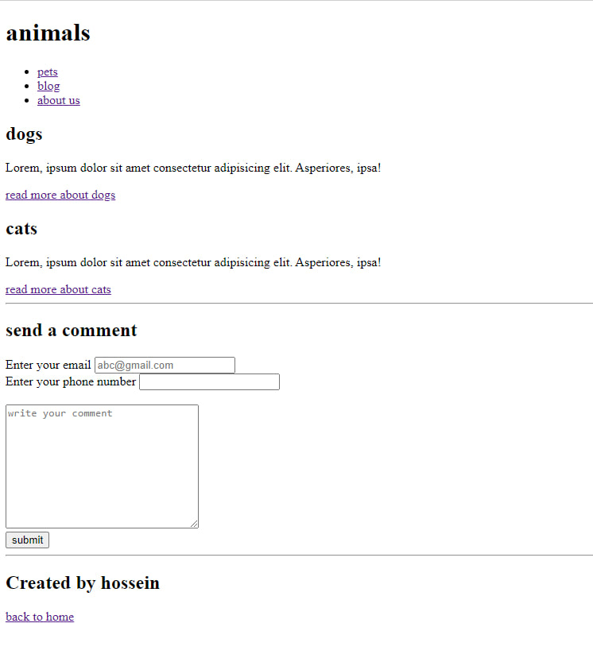

# class-quiz
**we want you to fork this repo and create a file with your full name and then bulid a page like below image**
___

## attention:

- Don't ask about which tag to use. Any tag that you think is correct and suitable, go ahead and use it.
- use the appropriate address in the href for the last page link (back to home), which should link to the index (home page) file. **Do not create an index file**

## last step:
Once you've created the page, please send a pull request from your forked repository to the "**develop**" branch of this repository.

---

After completing the pull requests, we merge them into the "develop" branch. Then, we create a table in the "index" file and include links to your pages in it. Finally, we merge the "develop" branch with "main" branch.

### *good luck*